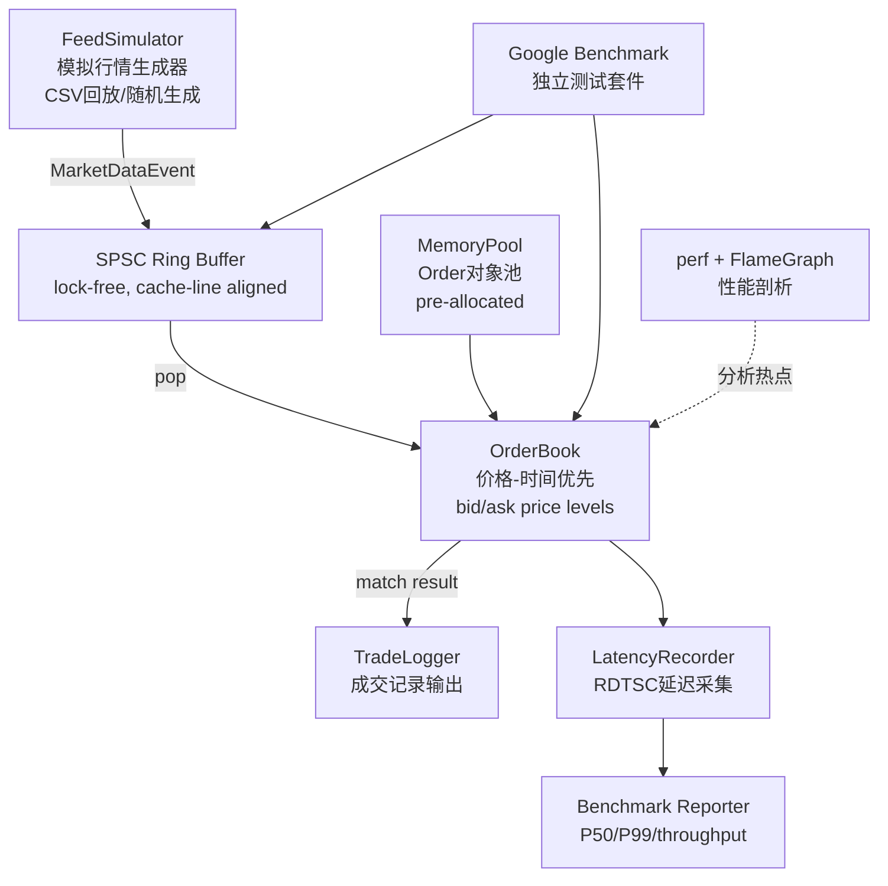

## 用户需求

在 gap year 剩余约 4 个月的时间窗口内（最晚 8 月中出国），以**每天 2-3 小时**的可持续节奏，完成一个**可写进简历、可用于量化私募面试**的 C++ 低延迟量化项目，同时不完全中断刷题和投递。

## 产品定位

**Low-Latency Order Book & Matching Engine（C++20，Linux）**

一个模拟真实量化交易核心组件的系统：接收模拟行情数据、维护 Order Book、执行价格-时间优先撮合。全部使用模拟数据，不接入真实交易所。重点在工程实现质量与可量化的性能指标上。

## 核心产出（按优先级排序）

1. **可运行的 GitHub 仓库**：完整代码 + 详细 README（架构图、编译说明、benchmark 数据截图）
2. **可量化的性能数据**：有具体延迟数字（P50/P99）、吞吐率，火焰图截图说明优化过程
3. **简历 bullet points**：3 条，包含具体量化指标，可直接投递量化私募岗位
4. **博客文章**：2 篇，作为技术深度的背书（可发到个人网站）

## 时间与执行约束

- **每天 2-3 小时**，同时保留每天 1 题 LeetCode 和定期投递
- **总周期 10 周**（比 Grok 的 6 周计划延长，符合实际节奏），第 7-8 周可同步开始投递
- **性能目标现实化**：以可测量为核心目标，P99 < 5μs 为合理可达目标（无需专业硬件），不追求纳秒级
- **分阶段可交付物**：每个里程碑有独立可演示产出，避免烂尾

## 技术栈

| 类别 | 选型 | 理由 |
| --- | --- | --- |
| 语言 | C++20 | 量化私募标配，std::atomic/concepts/jthread |
| 构建 | CMake 3.20+ | 主流 C++ 构建工具 |
| 测试 | Google Test + Google Benchmark | 延迟数据必须有框架背书 |
| 性能分析 | perf + FlameGraph (Brendan Gregg) | 火焰图是面试中最直观的展示工具 |
| 数据结构 | 自定义 SPSC lock-free ring buffer | std::queue+mutex 的替代，是量化面试必考点 |
| 内存管理 | 自定义 Object Pool（pre-allocated） | 避免热路径 malloc/new |
| 价格数据 | 整数定价（int64, scaled by 1e6） | 避免浮点运算，行业标准做法 |
| 延迟测量 | `__rdtsc` + `clock_gettime(CLOCK_REALTIME)` | 纳秒级精度，可报告 P50/P99 |
| 文档 | Markdown README + Mermaid 架构图 | GitHub 直接渲染 |


## 实现思路

**整体思路**：分三个阶段推进，每个阶段有独立的可交付物，前一阶段完成后才进入下一阶段，防止因难度过高导致烂尾。

**阶段一（打地基）**：先把 Order Book 核心数据结构和单线程撮合逻辑做扎实，保证功能正确性。这是最重要的基础，也是面试时最常被追问细节的部分。

**阶段二（加速度）**：引入 lock-free SPSC ring buffer 将 feed 数据与撮合引擎解耦，接入 perf + flamegraph 建立性能 baseline，再做针对性优化（cache-friendly、内存池、false sharing 消除）。

**阶段三（出成果）**：完善 benchmark、写 README 和博客，同步开始投递。

**关键技术决策**：

- **性能目标现实化**：P99 < 5μs（无 DPDK/RDMA 条件下合理可达），不追求 500ns，避免因目标不可达导致放弃
- **优先做对、再做快**：Week 1-3 不引入 lock-free，先用 mutex 保证功能正确，Week 4 再替换为 SPSC，这样有"before/after"对比数据，面试故事更完整
- **SPSC 而非 MPMC**：SPSC（Single Producer Single Consumer）实现难度低 50%，足够面试展示，避免 MPMC 的 ABA 问题增加调试成本
- **不做 Backtester**：Grok 计划的 backtester 对求职价值有限，砍掉节省时间

## 实现注意事项

- **lock-free ring buffer 的内存序**：head 用 `memory_order_acquire`，tail 用 `memory_order_release`，错误使用会导致难以复现的 bug，先在单元测试中验证正确性
- **perf 使用权限**：`perf` 需要 `sudo` 或调整 `/proc/sys/kernel/perf_event_paranoid`，在开发机上提前确认
- **RDTSC 注意事项**：多核环境下 TSC 可能不同步，需绑核（`taskset -c 0`）后再测量，否则延迟数据不可信
- **避免过度优化**：只优化 benchmark 显示的实际热点，不要盲目优化——火焰图会告诉你真正的瓶颈在哪
- **延迟测量方式**：用 `std::vector<uint64_t>` 收集每次 tick 的延迟，事后排序取 P50/P99，不要用 `std::cout` 实时打印（会影响测量结果）

## 架构设计



## 目录结构

```
/home/hjz/Matching_Machine/
├── CMakeLists.txt                   # [NEW] 根构建文件，管理所有 target 和依赖（GTest/GBenchmark via FetchContent）
├── README.md                        # [NEW] 项目主文档：架构图、benchmark 数据截图、编译运行指南、简历 bullets
├── .gitignore                       # [NEW] 忽略 build/ cmake-build-*
│
├── include/
│   ├── order.h                      # [NEW] Order 结构体定义（id, symbol, side, price, qty, timestamp）整数定价
│   ├── order_book.h                 # [NEW] OrderBook 类接口：add/cancel/modify，bid/ask price level 维护
│   ├── spsc_ring_buffer.h           # [NEW] lock-free SPSC ring buffer 模板类，cache-line 对齐
│   ├── memory_pool.h                # [NEW] 固定大小 Object Pool，pre-allocated，无锁分配
│   ├── matching_engine.h            # [NEW] MatchingEngine 类接口：撮合逻辑、trade 生成
│   ├── feed_simulator.h             # [NEW] FeedSimulator：CSV 回放或随机生成 MarketDataEvent
│   └── latency_recorder.h          # [NEW] RDTSC 延迟采集，P50/P99 计算输出
│
├── src/
│   ├── order_book.cpp               # [NEW] OrderBook 实现：std::map<price, deque<Order*>> 初版（mutex），后期优化
│   ├── matching_engine.cpp          # [NEW] 价格-时间优先撮合实现
│   ├── feed_simulator.cpp           # [NEW] CSV 解析器 + 随机数据生成器
│   └── main.cpp                     # [NEW] 系统入口：初始化各模块，启动 feed → 撮合 → 报告完整流程
│
├── tests/
│   ├── test_order_book.cpp          # [NEW] GTest：订单插入/取消/撮合正确性验证（100% 正确性为第一优先级）
│   ├── test_spsc_ring_buffer.cpp    # [NEW] GTest：并发生产消费正确性，边界条件
│   └── test_memory_pool.cpp         # [NEW] GTest：内存池分配/归还，无泄漏验证
│
├── benchmarks/
│   ├── bench_order_book.cpp         # [NEW] Google Benchmark：订单插入/撮合吞吐率，P99 延迟
│   └── bench_spsc_ring_buffer.cpp  # [NEW] Google Benchmark：ring buffer 单核吞吐率对比（mutex vs lock-free）
│
├── data/
│   └── sample_ticks.csv             # [NEW] 样本行情数据（模拟 tick 数据，用于 feed 回放测试）
│
├── scripts/
│   ├── run_perf.sh                  # [NEW] 一键 perf record + report，生成 flamegraph SVG
│   └── gen_benchmark_report.sh     # [NEW] 运行 benchmark 并输出格式化报告（含 P50/P99 表格）
│
└── docs/
    ├── blog_1_lowlatency_design.md  # [NEW] 博客草稿1：低延迟系统设计原则（lock-free, memory pool, false sharing）
    └── blog_2_optimization_report.md # [NEW] 博客草稿2：优化前后数据对比（mutex → lock-free，含火焰图截图）
```

## 关键数据结构

```cpp
// include/order.h
struct alignas(64) Order {  // cache-line 对齐避免 false sharing
    uint64_t  order_id;
    uint64_t  timestamp_ns;   // RDTSC 时间戳
    int64_t   price;          // 整数定价：实际价格 * 1,000,000
    int64_t   quantity;
    char      symbol[8];
    enum class Side : uint8_t { BUY, SELL } side;
    enum class Type : uint8_t { LIMIT, CANCEL } type;
};

// include/spsc_ring_buffer.h
template<typename T, size_t Capacity>
class SPSCRingBuffer {
    // 生产者和消费者 cache-line 分离，避免 false sharing
    alignas(64) std::atomic<size_t> head_{0};
    alignas(64) std::atomic<size_t> tail_{0};
    std::array<T, Capacity> buffer_;
public:
    bool try_push(const T& item);  // memory_order_release
    bool try_pop(T& item);         // memory_order_acquire
};
```